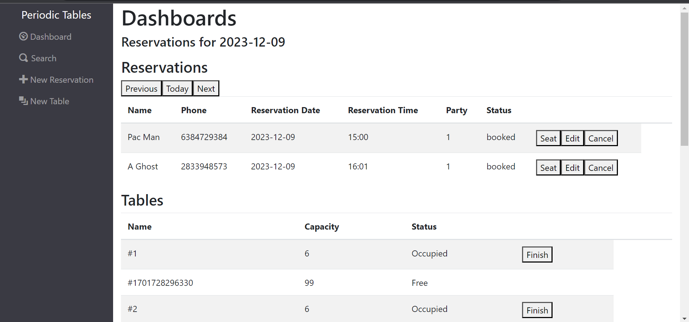

# Capstone: Restaurant Reservation System
https://starter-restaurant-reservation-front-git-697169-jessycapriester.vercel.app/
> The software is used only by restaurant personnel when a customer calls to request a reservation.

## Technologies
The following are some of the the technologies used in this project:
- React.js
- CSS
- Node.js 
- Express
- PostgreSQL
- Node
- Express
- PostgreSQL API

## Existing files

| Folder/file path | Description                                                      |
| ---------------- | ---------------------------------------------------------------- |
| `./back-end`     | The backend project, which runs on `localhost:5001` by default.  |
| `./front-end`    | The frontend project, which runs on `localhost:3000` by default. |

## Installation

1. Fork and clone this repository.
1. Run `cp ./back-end/.env.sample ./back-end/.env`.
1. Update the `./back-end/.env` file with the connection URL's to your ElephantSQL database instance.
1. Run `cp ./front-end/.env.sample ./front-end/.env`.
1. You should not need to make changes to the `./front-end/.env` file unless you want to connect to a backend at a location other than `http://localhost:5001`.
1. Run `npm install` to install project dependencies.
1. Run `npm run start:dev` to start your server in development mode.

## Running tests

This project has unit, integration, and end-to-end (e2e) tests. 
Test are split up by user story. You can run the tests for a given user story by running:

`npm run test:X` where `X` is the user story number.

Have a look at the following examples:

- `npm run test:1` runs all the tests for user story 1 (both frontend and backend).
- `npm run test:3:backend` runs only the backend tests for user story 3.
- `npm run test:3:frontend` runs only the frontend tests for user story 3.

> **Note** When running `npm run test:X` If the frontend tests fail, the tests will stop before running the backend tests. Remember, you can always run `npm run test:X:backend` or `npm run test:X:frontend` to target a specific part of the application.

Since tests take time to run, you might want to consider running only the tests for the user story you're working on at any given time.

- `npm test` runs _all_ tests.
- `npm run test:backend` runs _all_ backend tests.
- `npm run test:frontend` runs _all_ frontend tests.
- `npm run test:e2e` runs only the end-to-end tests.

> **Note**: After running `npm test`, `npm run test:X`, or `npm run test:e2e` you might see something like the following in the output: `[start:frontend] Assertion failed:`. This is not a failure, it is just the frontend project getting shutdown automatically.

> **Note**: If you are getting a `unable to resolve dependency tree` error when running the frontend tests, run the following command: `npm install --force --prefix front-end`. This will allow you to run the frontend tests.

> **Hint**: If you stop the tests before they finish, it can leave the test database in an unusual state causing the tests to fail unexpectedly the next time you run them. If this happens, delete all tables in the test database, including the `knex_*` tables, and try the tests again.

### Create and list reservations

As a restaurant manager 
I want to create a new reservation when a customer calls 
so that I know how many customers will arrive at the restaurant on a given day.

 The `/reservations/new` contains a form with the following non-nullable fields
     - First name
     - Last name
     - Mobile number
     - Date of reservation
     - Time of reservation
     - Number of people in the party, which must be at least 1 person.
    
  Submitting this form saves the new reservation, then displays the `/dashboard` page for the date of the new reservation. Reservations can be from WED-MON from 10:30am-9:30pm

 The `/dashboard` page lists all reservations for one date only. (E.g. if the URL is `/dashboard?date=2035-12-30` it will list the reservations for that date). The reservations are sorted by time.
   - The next, previous, and today buttons allow the user to see reservations on other dates

### Seat reservation

As a restaurant manager,  
When a customer with an existing reservation arrives at the restaurant 
I want to seat (assign) their reservation to a specific table 
so that I know which tables are occupied and free.

The `/tables/new` has form with the following required and not-nullable fields:
     - Table name - which must be at least 2 characters long.
     - Capacity - this is the number of people that can be seated at the table, which must be at least 1 person.

    When this form is submiited it will save the new table then displays the `/dashboard` page

The `/dashboard` page will:
   - display a list of all reservations in one area. Each reservation in the list has a SEAT button.
   - display a list of all tables, sorted by table name, in another area of the dashboard each tabledisplays "Free" or "Occupied" depending on whether a reservation is seated at the table.

The `/reservations/:reservation_id/seat` has a form with the following required and not-nullable fields:
     - Table number
     
  When this form is submitted the reservation is assigned to the table, and then displays the `/dashboard` page

### Finish an occupied table

As a restaurant manager 
I want to free up an occupied table when the guests leave 
so that I can seat new guests at that table. 

The `/dashboard` page will displays a "Finish" button on each _occupied_ table. Clicking the "Finish" button will display the following confirmation: "Is this table ready to seat new guests? This cannot be undone." If the user selects "Ok" the system will remove the reservation from the table assignment.

### Reservation Status

As a restaurant manager 
I want a reservation to have a status of either booked, seated, or finished 
so that I can see which reservation parties are seated, and finished reservations are hidden from the dashboard.

The `/dashboard` page will display the status of the reservation. The default status is "booked". A seat button will be visible when the reservation status is "booked". Clicking the Seat button changes the status to "seated". Clicking the Finish button associated with the table changes the reservation status to "finished" and removes the reservation from the dashboard.

### Search for a reservation by phone number

As a restaurant manager 
I want to search for a reservation by phone number (partial or complete) 
so that I can quickly access a customer's reservation when they call about their reservation. 

The `/search` page displays a search box. Clicking on the "Find" button will look through the reservation(s) in the database and display all matched records on the `/search` page. The search page will display all reservations matching the phone number, regardless of status.

### Change an existing reservation

As a restaurant manager 
I want to be able to modify a reservation if a customer calls to change or cancel their reservation 
so that reservations are accurate and current.

The `/dashboard` and the `/search` page display an "Edit" button next to each reservation clicking the "Edit" button will navigate the user to the `/reservations/:reservation_id/edit` page. Only reservations with a status of "booked" can be edited. Clicking the "Submit" button will save the reservation. The dashboard also displays a "Cancel" button next to each reservation will display the following confirmation: "Do you want to cancel this reservation? This cannot be undone. Clicking "Ok" on the confirmation dialog, sets the reservation status to `cancelled`

### APIs

"/reservations"
  - GET lists the reservations. If given a date will get all the reservations that are not finished with that date. And if given a phone number, it will get all the reservations with the matching phone number
  - POST creates a new reservation 

"/reservations/:reservationId"
  - GET lists the reservation with the matching id
  - PUT updates the reervation 

"/reservations/:reservationId/status"
 - PUT updates the matching reservations status

"/tables"
  - GET lists all the tables
  - POST creates a new table

"/tables/:tableId"
  - GET lists the table with the matching id

"/tables/:tableId/seat"
  - PUT updates the table with the matching id
  - DELETE removes the reservation assignment from the table

